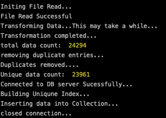

## BoatMan

Formats and transports all the data reaped by [PowerReaper](https://github.com/Parthipan-Natkunam/power-reaper) to a mongo persistence.

    

### Intention:

BoatMan along with [PowerReaper](https://github.com/Parthipan-Natkunam/power-reaper) will function as the data feeder component to populate content for data provision, analysis and visualization in a larger software system.

### Feature List:

- Parses the .txt file generated by [PowerReaper](https://github.com/Parthipan-Natkunam/power-reaper)
- Formats data into a mongodb compatible format.
- Removes duplicate data entries.
- Inserts formatted data into a mongo collection.
